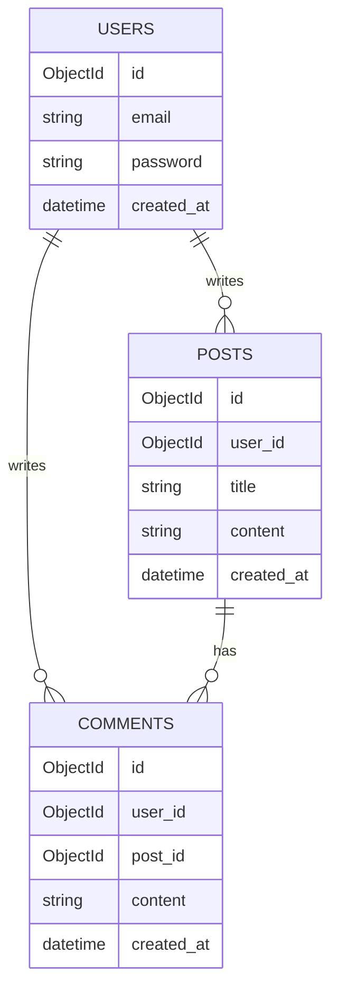

# 데이터베이스 스키마 [Database Schema]

## 1. 스키마 개요(Schema Overview)
### 1.1. ERD


## 2. 컬렉션 상세(Collection Details)
### 2.1. Users 컬렉션
```json
{
    "name": "users",
    "properties": {
        "_id": {"type": "ObjectId", "required": true},
        "email": {"type": "String", "unique": true},
        "password": {"type": "String", "encrypted": true},
        "name": {"type": "String", "maxLength": 50},
        "role": {"type": "String", "enum": ["user", "admin"]},
        "created_at": {"type": "Date", "default": "now"}
    },
    "indexes": [
        {"email": 1, "unique": true}
    ]
}
```

### 2.2. 인덱스 전략(Index Strategy)
| 컬렉션 | 인덱스 | 타입 | 목적 |
|--------|--------|------|------|
| users | email | Unique | 이메일 검색 |
| posts | user_id | Regular | 사용자별 게시물 검색 |

## 3. 데이터 관계(Data Relationships)
### 3.1. 관계 다이어그램


### 3.2. 제약조건(Constraints)
- 외래 키 관계
- 캐스케이드 삭제 규칙
- 유효성 검증 규칙

## 4. 마이그레이션(Migration)
### 4.1. 마이그레이션 전략
```json
{
    "version": "1.0.0",
    "up": [
        "createCollection('users')",
        "createIndexes('users', {email: 1})"
    ],
    "down": [
        "dropCollection('users')"
    ]
}
```

## 5. 백업 전략(Backup Strategy)
### 5.1. 백업 정책
| 백업 유형 | 주기 | 보관 기간 |
|-----------|------|-----------|
| 전체 백업 | 일 1회 | 30일 |
| 증분 백업 | 시간당 | 7일 |