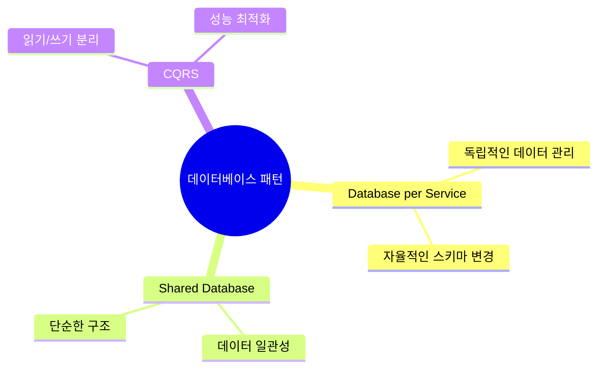
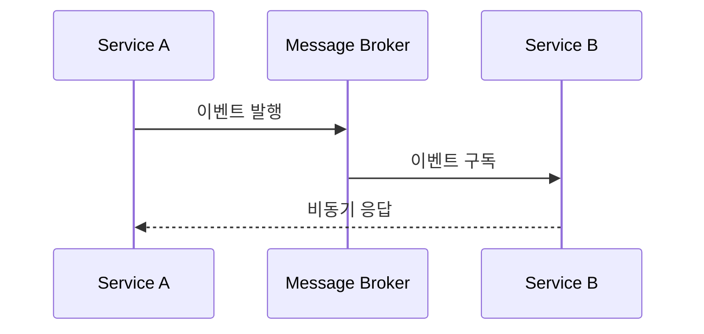
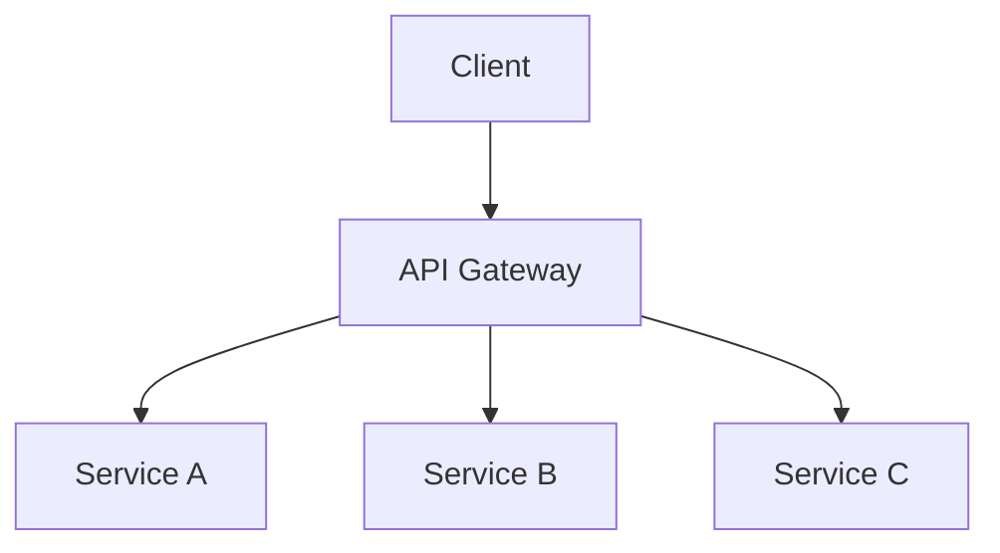

# 마이크로서비스 패턴 [Microservice Patterns]

## 1. 핵심 패턴(Core Patterns)
### 1.1. 데이터베이스 패턴

### 1.2. 통신 패턴

## 2. 구현 패턴(Implementation Patterns)
### 2.1. API Gateway 패턴

### 2.2. 서킷 브레이커 패턴
| 상태 | 설명 | 동작 |
|------|------|------|
| Closed | 정상 동작 | 요청 처리 |
| Open | 장애 상태 | 요청 차단 |
| Half-Open | 복구 시도 | 일부 요청 허용 |