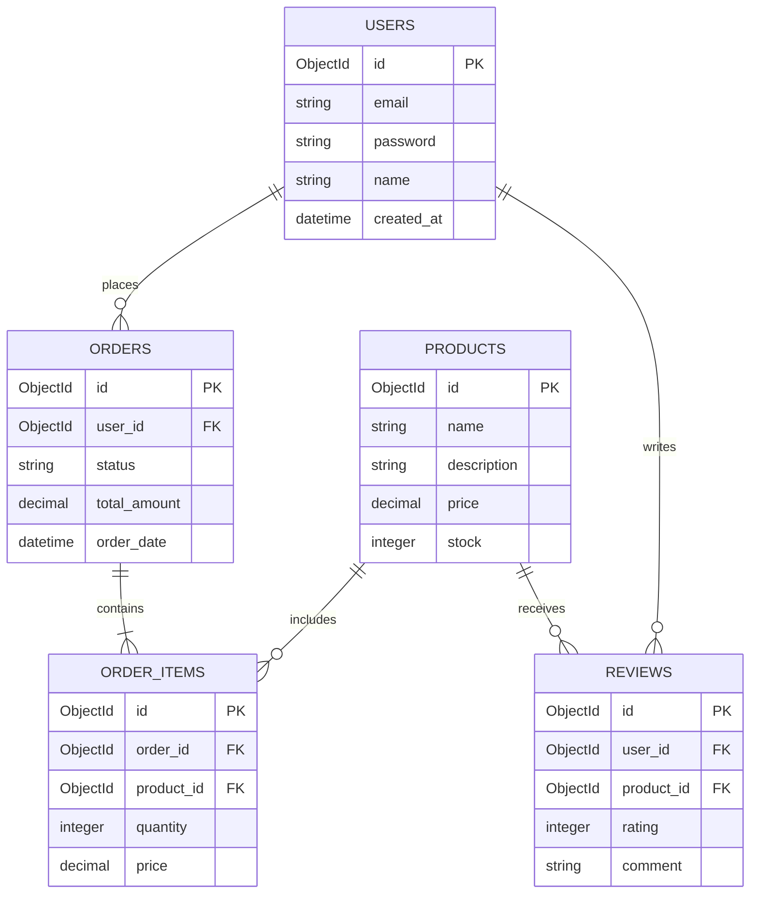
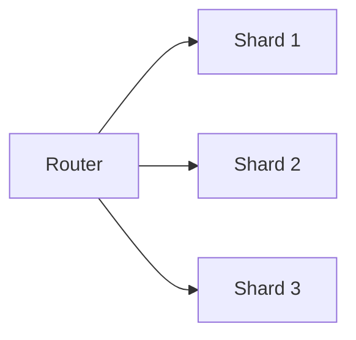
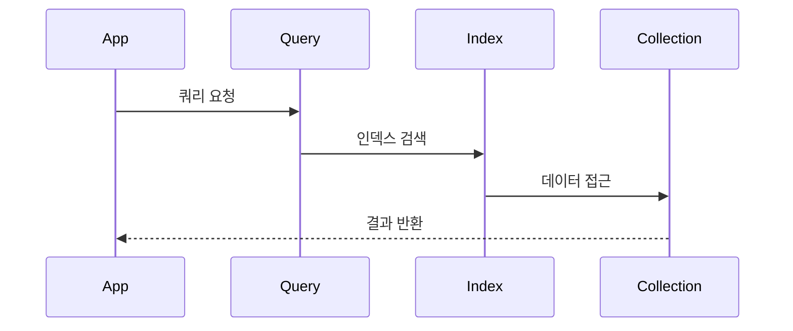
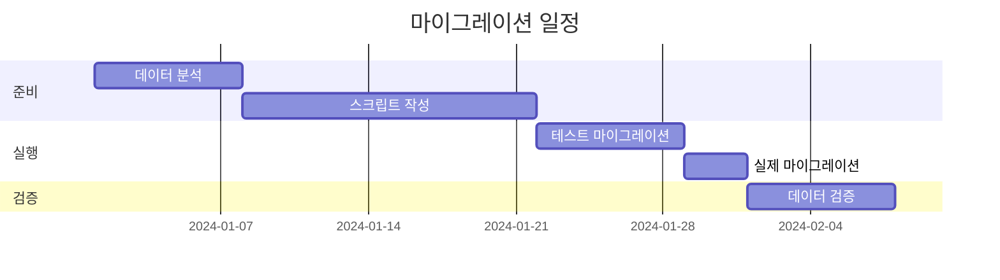
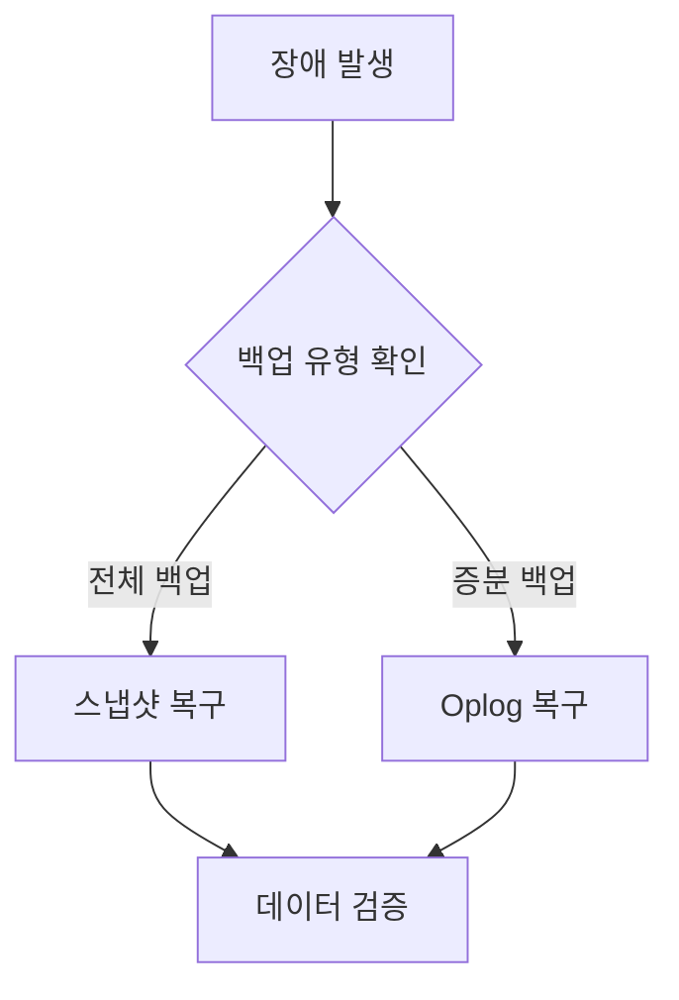
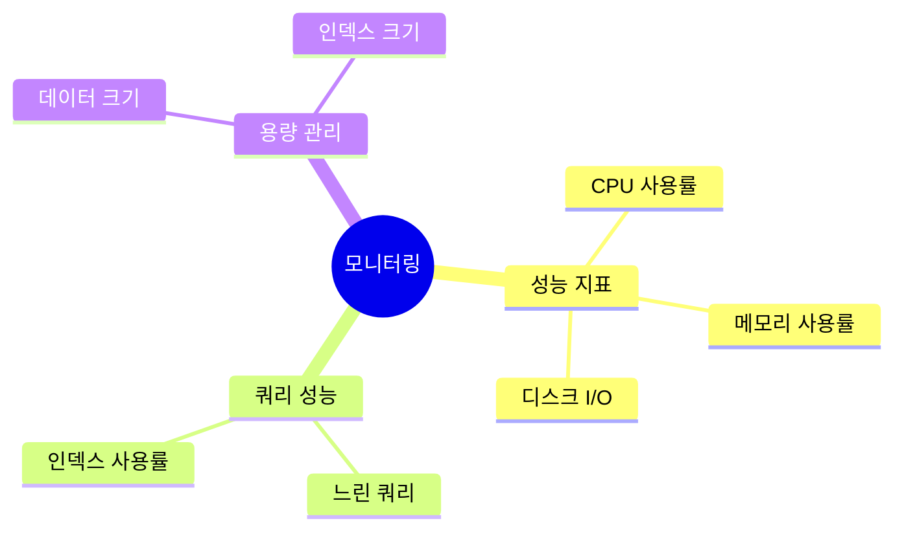

# 데이터베이스 설계서 [Database Design Document]

## 문서 이력(Document History)
| 버전 | 날짜 | 작성자 | 승인자 | 변경내용 |
|-----|------|--------|--------|----------|
| 1.0 | 2024.03.15 | 홍길동 | 김철수 | 최초 작성 |

## 1. 개요(Overview)
### 1.1. 목적(Purpose)
본 문서는 [프로젝트명]의 데이터베이스 설계 내용을 정의한다.

### 1.2. 범위(Scope)
- 데이터베이스 구조 설계
- 테이블 정의
- 관계 정의
- 인덱스 설계

### 1.3. 데이터베이스 환경(Database Environment)
| 항목 | 내용 |
|-----|------|
| DBMS | MongoDB 6.0 |
| 문자셋 | UTF-8 |
| 시간대 | UTC+9 |

## 2. 논리적 데이터 모델(Logical Data Model)
### 2.1. ERD(Entity Relationship Diagram)


### 2.2. 엔티티 정의(Entity Definitions)
| 엔티티명 | 설명 | 예상 레코드 수 |
|---------|------|----------------|
| users | 사용자 정보 | 100만 |
| orders | 주문 정보 | 500만 |
| products | 상품 정보 | 10만 |

## 3. 물리적 데이터 모델(Physical Data Model)
### 3.1. 컬렉션 구조(Collection Structure)
#### 3.1.1. users 컬렉션
```json
{
    "name": "users",
    "properties": {
        "_id": {"type": "ObjectId", "required": true},
        "email": {"type": "String", "unique": true},
        "password": {"type": "String", "encrypted": true},
        "name": {"type": "String", "maxLength": 50},
        "created_at": {"type": "Date", "default": "now"}
    },
    "indexes": [
        {"email": 1, "unique": true}
    ]
}
```

### 3.2. 샤딩 전략(Sharding Strategy)


| 컬렉션 | 샤딩 키 | 설명 |
|--------|---------|------|
| orders | user_id | 사용자 기준 분산 |
| products | category | 카테고리 기준 분산 |

## 4. 인덱스 설계(Index Design)
### 4.1. 인덱스 목록(Index List)
| 컬렉션 | 인덱스명 | 필드 | 타입 | 설명 |
|--------|----------|------|------|------|
| users | idx_email | email | Unique | 이메일 검색용 |
| orders | idx_user_date | {user_id: 1, order_date: -1} | Compound | 사용자별 주문 조회 |

### 4.2. 인덱스 사용 패턴(Index Usage Patterns)


## 5. 데이터 마이그레이션(Data Migration)
### 5.1. 마이그레이션 계획(Migration Plan)


### 5.2. 롤백 계획(Rollback Plan)
1. 백업 데이터 준비
2. 롤백 스크립트 준비
3. 검증 절차 정의

## 6. 백업 및 복구(Backup & Recovery)
### 6.1. 백업 정책(Backup Policy)
| 백업 유형 | 주기 | 보관 기간 | 방식 |
|-----------|------|-----------|------|
| 전체 백업 | 일간 | 30일 | 스냅샷 |
| 증분 백업 | 시간 | 7일 | Oplog |

### 6.2. 복구 절차(Recovery Procedure)


## 7. 성능 최적화(Performance Optimization)
### 7.1. 쿼리 최적화(Query Optimization)
| 쿼리 패턴 | 최적화 방안 | 예상 효과 |
|-----------|-------------|-----------|
| 사용자 조회 | 인덱스 추가 | 응답시간 50% 감소 |
| 주문 내역 | 복합 인덱스 | 응답시간 70% 감소 |

### 7.2. 모니터링 계획(Monitoring Plan)


## 8. 보안 설계(Security Design)
### 8.1. 접근 제어(Access Control)
| 역할 | 권한 | 설명 |
|------|------|------|
| 관리자 | ALL | 모든 권한 |
| 운영자 | READ, WRITE | 데이터 조회/수정 |
| 사용자 | READ | 데이터 조회만 가능 |

### 8.2. 암호화 정책(Encryption Policy)
- 필드 레벨 암호화
- 통신 구간 암호화 (TLS)
- 저장 데이터 암호화

## 9. 부록(Appendix)
### 9.1. 용어 사전(Glossary)
| 용어 | 설명 |
|------|------|
| Shard | 분산 데이터베이스의 단위 |
| Index | 데이터 검색을 위한 자료구조 |

### 9.2. 참고 문서(References)
- MongoDB 공식 문서
- 데이터 모델링 가이드
- 성능 튜닝 가이드