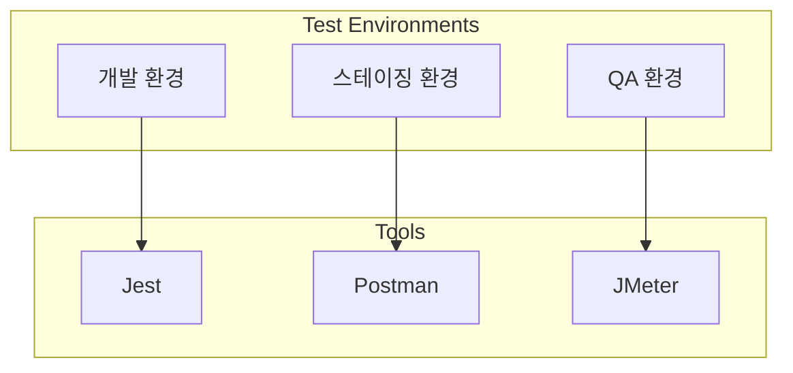
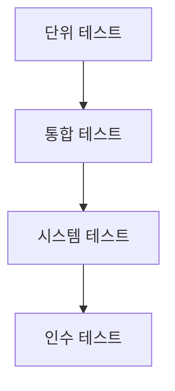
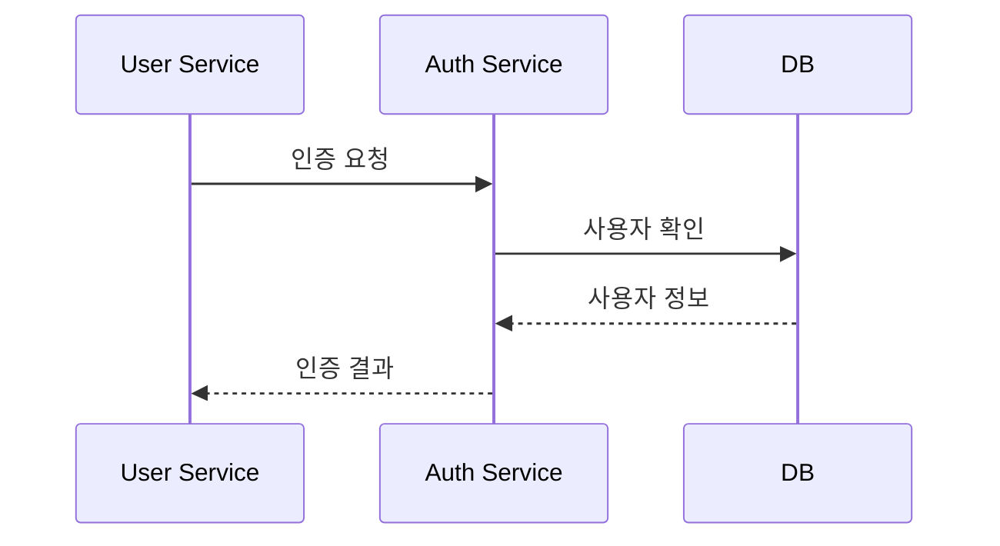
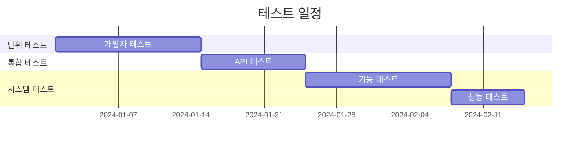
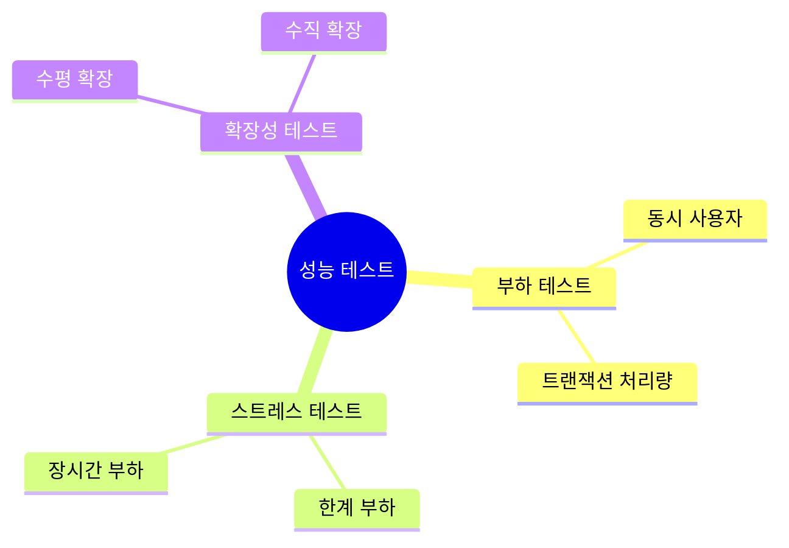
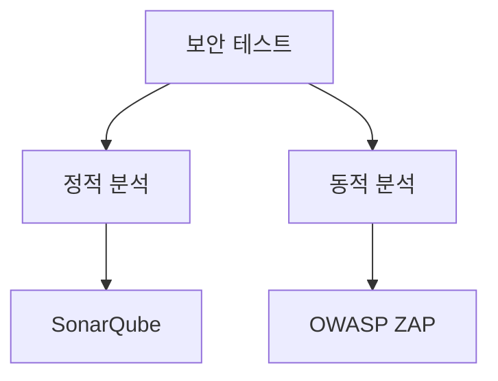

# 테스트 계획서 [Test Plan]

## 문서 이력(Document History)
| 버전 | 날짜 | 작성자 | 승인자 | 변경내용 |
|-----|------|--------|--------|----------|
| 1.0 | 2024.03.15 | 홍길동 | 김철수 | 최초 작성 |

## 1. 개요(Overview)
### 1.1. 목적(Purpose)
본 문서는 [프로젝트명]의 테스트 계획을 정의한다.

### 1.2. 범위(Scope)
- 단위 테스트
- 통합 테스트
- 시스템 테스트
- 성능 테스트
- 보안 테스트

### 1.3. 테스트 환경(Test Environment)


## 2. 테스트 전략(Test Strategy)
### 2.1. 테스트 수준(Test Levels)


### 2.2. 테스트 유형(Test Types)
| 테스트 유형 | 목적 | 도구 | 담당자 |
|------------|------|------|--------|
| 단위 테스트 | 개별 컴포넌트 검증 | Jest | 개발자 |
| API 테스트 | API 기능 검증 | Postman | QA |
| 부하 테스트 | 성능 검증 | JMeter | 성능 테스트 담당자 |

## 3. 테스트 케이스(Test Cases)
### 3.1. 단위 테스트(Unit Test)
```json
{
    "테스트_ID": "UT-001",
    "테스트_항목": "사용자 등록",
    "선행조건": "유효한 사용자 데이터",
    "테스트_단계": [
        "이메일 유효성 검사",
        "비밀번호 유효성 검사",
        "중복 확인"
    ],
    "기대결과": "사용자 등록 성공"
}
```

### 3.2. 통합 테스트(Integration Test)


## 4. 테스트 일정(Test Schedule)
### 4.1. 마일스톤(Milestones)


### 4.2. 리소스 계획(Resource Plan)
| 역할 | 인원 | 기간 | 담당 업무 |
|------|------|------|-----------|
| QA 리더 | 1명 | 전체 기간 | 테스트 총괄 |
| QA 엔지니어 | 3명 | 테스트 기간 | 테스트 실행 |
| 개발자 | 5명 | 단위 테스트 기간 | 단위 테스트 |

## 5. 테스트 실행(Test Execution)
### 5.1. 테스트 프로세스(Test Process)


### 5.2. 결함 관리(Defect Management)
| 심각도 | 설명 | 대응 시간 |
|--------|------|-----------|
| Critical | 서비스 중단 | 즉시 |
| Major | 주요 기능 장애 | 24시간 이내 |
| Minor | 경미한 문제 | 1주일 이내 |

## 6. 성능 테스트(Performance Test)
### 6.1. 성능 테스트 시나리오


### 6.2. 성능 목표
| 항목 | 목표 | 측정 방법 |
|------|------|-----------|
| 응답시간 | 평균 300ms | JMeter |
| TPS | 1000 TPS | JMeter |
| CPU 사용률 | 80% 이하 | Prometheus |

## 7. 보안 테스트(Security Test)
### 7.1. 보안 테스트 항목
- 인증/인가 테스트
- 입력값 검증
- SQL Injection
- XSS 방어
- CSRF 방어

### 7.2. 보안 테스트 도구


## 8. 테스트 산출물(Test Artifacts)
### 8.1. 산출물 목록
| 산출물 | 설명 | 작성자 |
|--------|------|--------|
| 테스트 계획서 | 테스트 전략 및 계획 | QA 리더 |
| 테스트 케이스 | 상세 테스트 시나리오 | QA 엔지니어 |
| 테스트 결과서 | 테스트 실행 결과 | QA 엔지니어 |

### 8.2. 보고서 템플릿
```json
{
    "테스트_결과_보고서": {
        "프로젝트": "프로젝트명",
        "테스트_기간": "YYYY.MM.DD - YYYY.MM.DD",
        "테스트_항목": "테스트 대상",
        "테스트_결과": {
            "전체_케이스": 100,
            "성공": 95,
            "실패": 5
        },
        "주요_결함": [],
        "개선사항": []
    }
}
```

## 9. 승인(Approval)
### 9.1. 승인자 정보
| 역할 | 이름 | 부서 | 서명 |
|------|------|------|------|
| PM | | | |
| QA 리더 | | | |
| 개발 리더 | | | |

### 9.2. 승인 이력
| 일자 | 버전 | 승인자 | 승인 내용 |
|------|------|--------|-----------|
| 2024.03.15 | 1.0 | 김철수 | 최초 승인 |