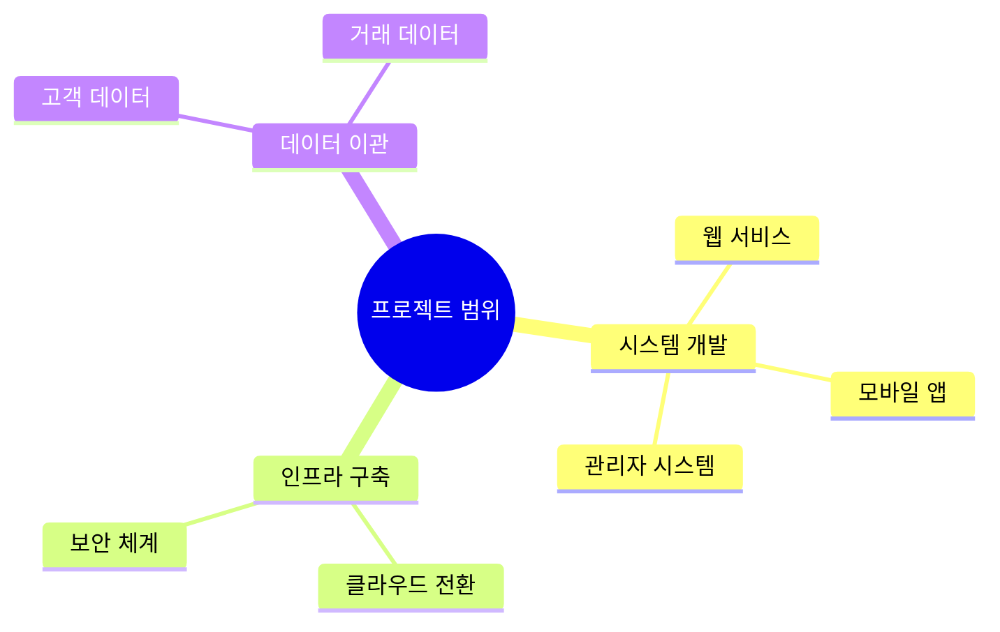
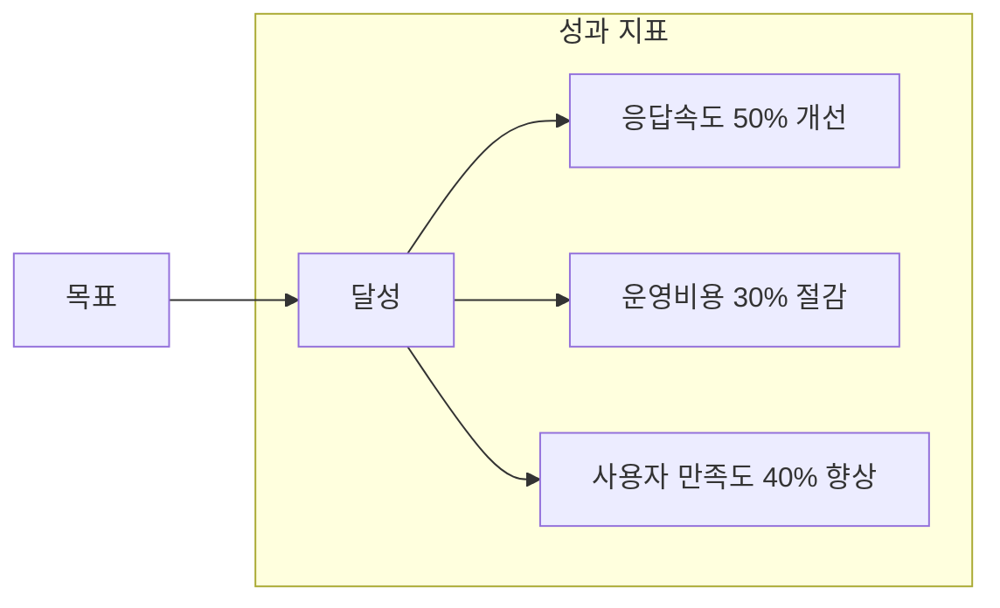
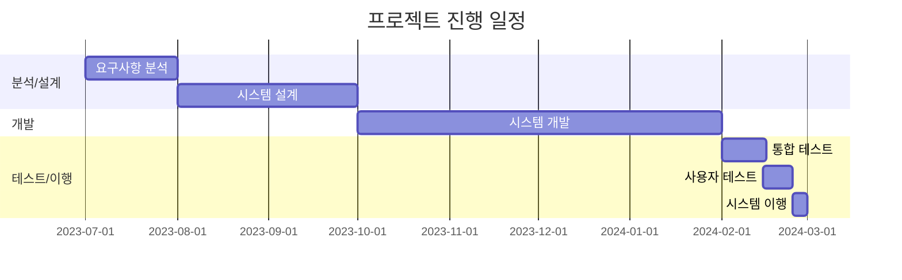
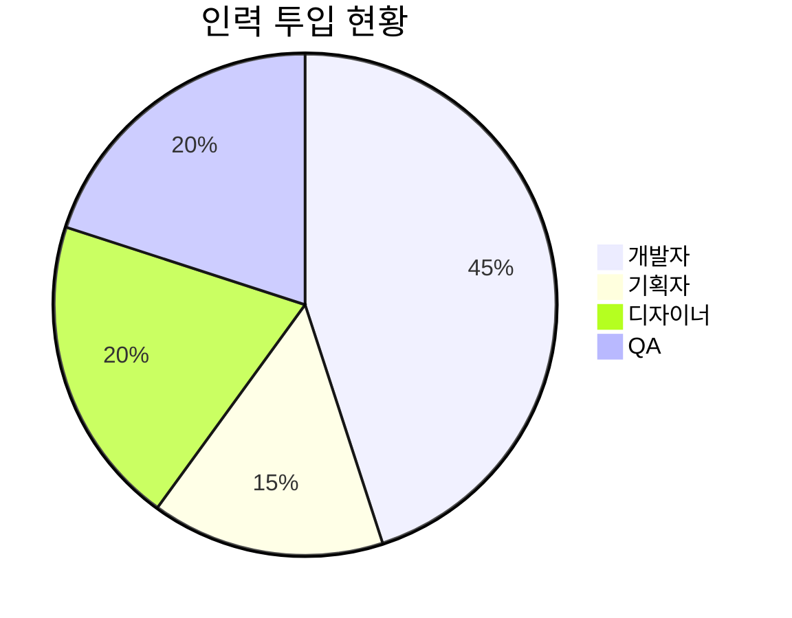
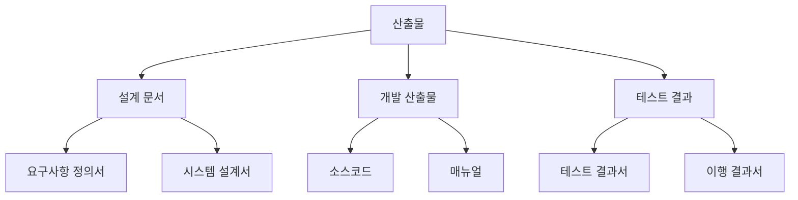
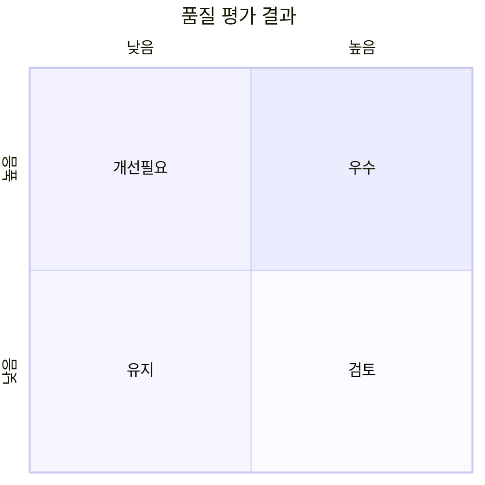
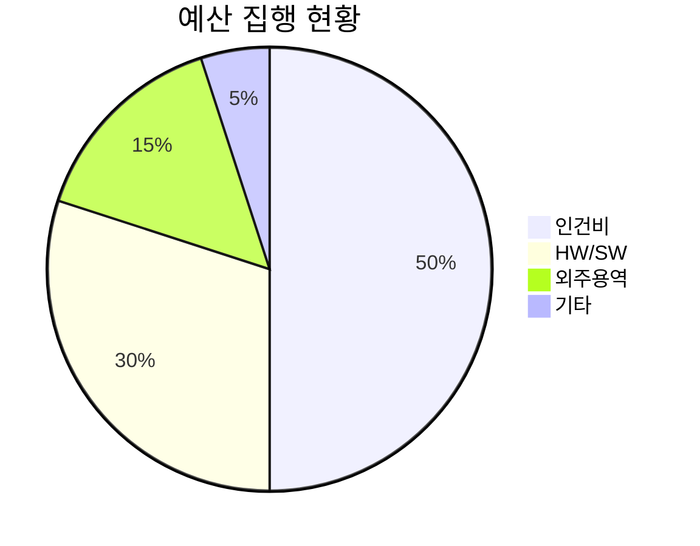
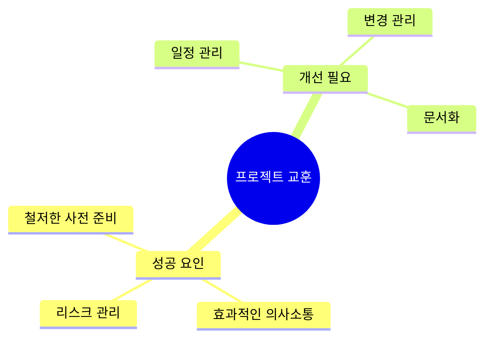
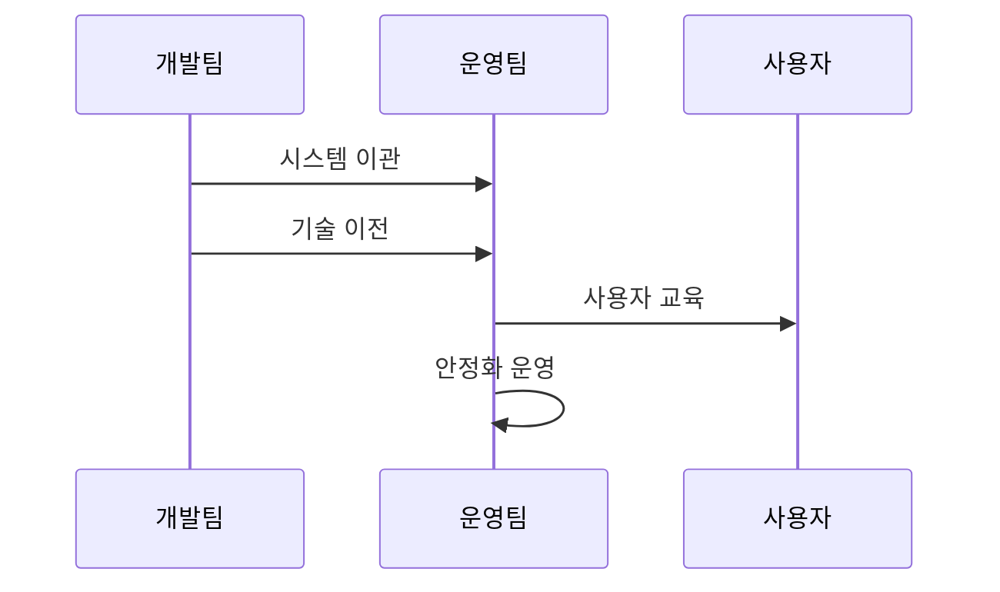

# 프로젝트 완료 보고서 [Project Completion Report]

## 문서 정보(Document Information)
| 항목 | 내용 |
|------|------|
| 프로젝트명 | 차세대 웹서비스 구축 프로젝트 |
| 수행 기간 | 2023.07.01 ~ 2024.02.29 (8개월) |
| 수행 부서 | IT개발팀 |
| 작성자 | 홍길동 (프로젝트 매니저) |

## 1. 프로젝트 개요(Project Overview)
### 1.1. 프로젝트 목적(Project Purpose)
- 레거시 시스템 현대화
- 사용자 경험 개선
- 시스템 확장성 확보

### 1.2. 프로젝트 범위(Project Scope)

## 2. 프로젝트 성과(Project Achievements)
### 2.1. 주요 성과 지표(Key Performance Indicators)

### 2.2. 정량적 성과(Quantitative Results)
| 항목 | 목표 | 달성 | 달성률 |
|------|------|------|--------|
| 시스템 성능 | 3초 이내 | 1.5초 | 150% |
| 동시접속자 | 3,000명 | 5,000명 | 167% |
| 가용성 | 99.9% | 99.95% | 100% |

## 3. 프로젝트 수행 현황(Project Execution Status)
### 3.1. 일정 현황(Schedule Status)

### 3.2. 투입 자원(Resource Allocation)

## 4. 산출물 현황(Deliverables Status)
### 4.1. 산출물 목록(Deliverables List)

### 4.2. 산출물 품질(Deliverables Quality)
| 산출물 | 완성도 | 검토결과 | 비고 |
|--------|--------|-----------|------|
| 설계 문서 | 100% | 승인 | - |
| 소스코드 | 100% | 승인 | - |
| 테스트 결과 | 100% | 승인 | - |

## 5. 이슈 및 위험 관리(Issue and Risk Management)
### 5.1. 주요 이슈 현황(Key Issues)

### 5.2. 이슈 해결 현황(Issue Resolution)
| 구분 | 발생 건수 | 해결 건수 | 해결률 |
|------|-----------|------------|--------|
| 기술 이슈 | 15 | 15 | 100% |
| 일정 이슈 | 8 | 8 | 100% |
| 범위 이슈 | 5 | 5 | 100% |

## 6. 품질 관리(Quality Management)
### 6.1. 품질 지표(Quality Metrics)

### 6.2. 테스트 결과(Test Results)
| 테스트 유형 | 케이스 수 | 성공 | 실패 |
|-------------|-----------|------|------|
| 단위 테스트 | 1,200 | 1,200 | 0 |
| 통합 테스트 | 500 | 498 | 2 |
| 성능 테스트 | 100 | 100 | 0 |

## 7. 예산 집행 현황(Budget Execution)
### 7.1. 예산 사용 현황(Budget Usage)

### 7.2. 예산 분석(Budget Analysis)
| 항목 | 계획 | 실적 | 차이 |
|------|------|------|------|
| 인건비 | 5억원 | 4.8억원 | -0.2억원 |
| HW/SW | 3억원 | 3.2억원 | +0.2억원 |
| 외주용역 | 1.5억원 | 1.5억원 | 0 |

## 8. 교훈 및 제언(Lessons Learned)
### 8.1. 주요 교훈(Key Lessons)

### 8.2. 개선 제언(Recommendations)
| 영역 | 개선사항 | 기대효과 |
|------|-----------|-----------|
| 프로세스 | 애자일 방법론 도입 | 유연한 대응 |
| 도구 | CI/CD 고도화 | 배포 효율화 |
| 조직 | 전담팀 구성 | 전문성 강화 |

## 9. 향후 계획(Future Plans)
### 9.1. 운영 이관 계획(Operation Transfer)

### 9.2. 후속 과제(Follow-up Tasks)
| 과제명 | 우선순위 | 예상 일정 | 담당 부서 |
|--------|-----------|------------|-----------|
| 모바일 고도화 | 높음 | 3개월 | 모바일팀 |
| 데이터 분석 | 중간 | 6개월 | 분석팀 |
| UI/UX 개선 | 중간 | 4개월 | 디자인팀 |