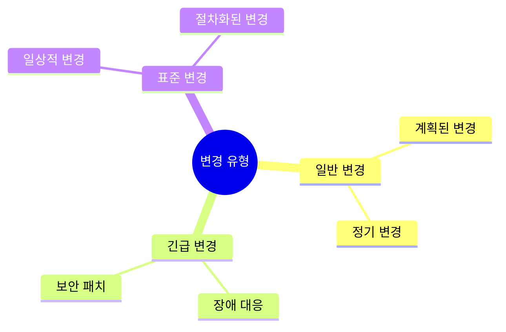
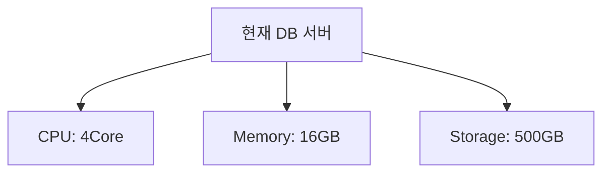
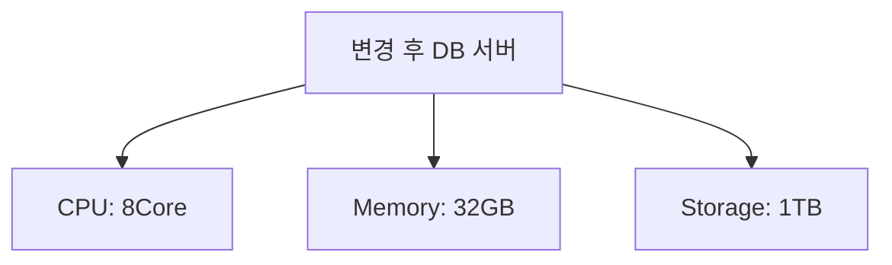
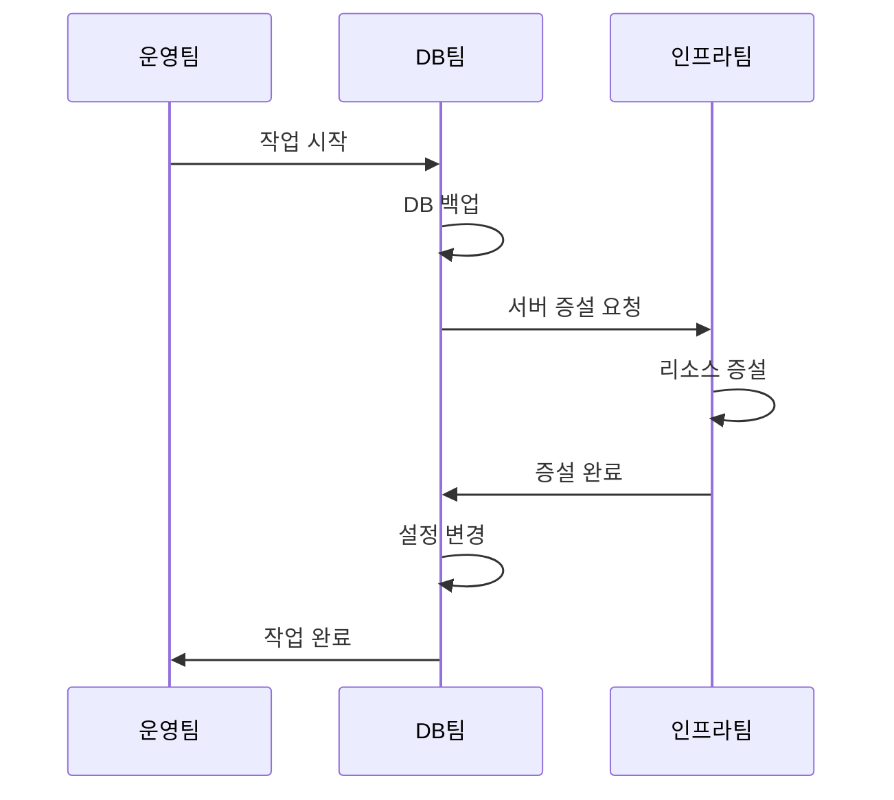
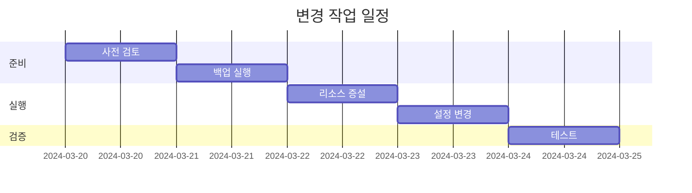
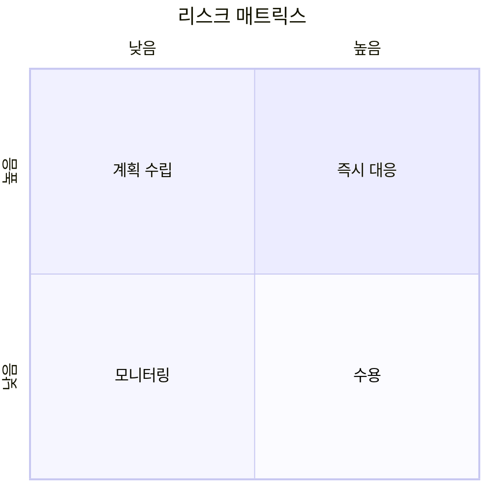
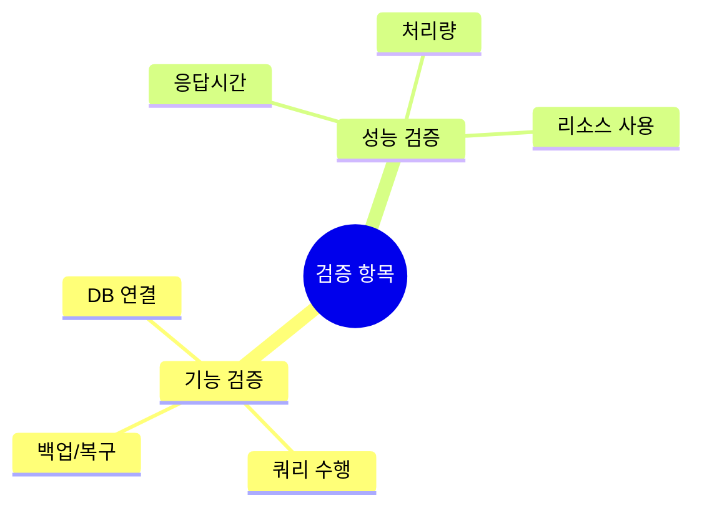
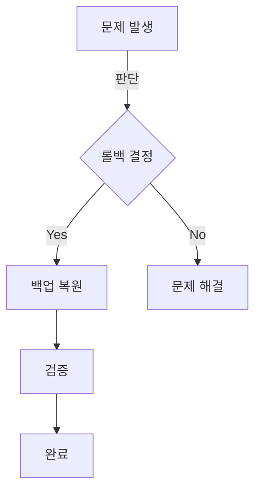
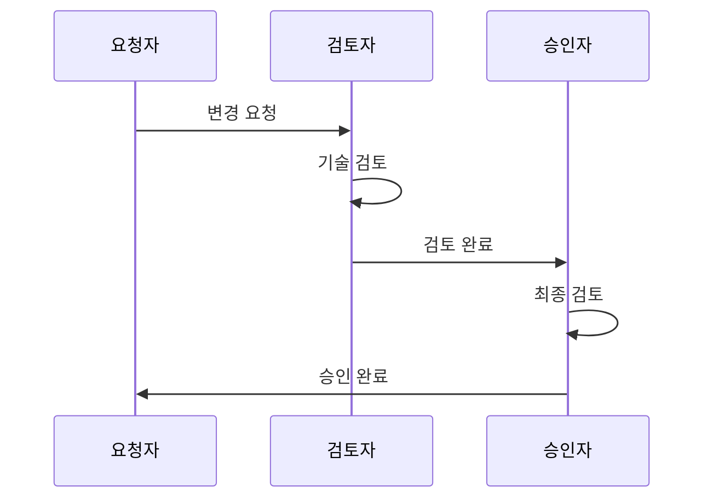

# 변경 요청서 [Change Request Form]

## 문서 이력(Document History)
| 버전 | 날짜 | 작성자 | 승인자 | 변경내용 |
|-----|------|--------|--------|----------|
| 1.0 | 2024.03.15 | 홍길동 | 김철수 | 최초 작성 |

## 1. 기본 정보(Basic Information)
### 1.1. 요청 개요(Request Overview)
| 항목 | 내용 |
|------|------|
| 변경 ID | CR-2024-001 |
| 제목 | 데이터베이스 서버 증설 |
| 요청자 | 홍길동 |
| 요청일 | 2024-03-15 |
| 우선순위 | 높음 |

### 1.2. 변경 분류(Change Classification)

## 2. 변경 상세(Change Details)
### 2.1. 변경 내용(Change Description)
#### 현재 상태(Current State)

#### 변경 후 상태(Target State)

### 2.2. 변경 범위(Change Scope)
| 영향 범위 | 영향도 | 관련 시스템 |
|-----------|--------|-------------|
| DB 서버 | 높음 | 주문관리시스템 |
| 백업 시스템 | 중간 | 백업서버 |
| 모니터링 | 낮음 | 관제시스템 |

## 3. 실행 계획(Implementation Plan)
### 3.1. 작업 절차(Work Procedure)

### 3.2. 작업 일정(Schedule)

## 4. 리스크 분석(Risk Analysis)
### 4.1. 리스크 평가(Risk Assessment)

### 4.2. 대응 방안(Mitigation Plan)
| 리스크 | 영향도 | 대응 방안 | 담당자 |
|--------|--------|-----------|--------|
| 서비스 중단 | 높음 | 백업 시스템 활용 | DB팀 |
| 데이터 손실 | 높음 | 사전 백업 수행 | DB팀 |
| 성능 저하 | 중간 | 모니터링 강화 | 운영팀 |

## 5. 검증 계획(Verification Plan)
### 5.1. 테스트 항목(Test Items)

### 5.2. 성공 기준(Success Criteria)
| 항목 | 기준 | 측정 방법 |
|------|------|-----------|
| 응답시간 | 3초 이내 | 성능 테스트 |
| CPU 사용률 | 70% 이하 | 모니터링 |
| 가용성 | 99.9% | 가동률 측정 |

## 6. 롤백 계획(Rollback Plan)
### 6.1. 롤백 절차(Rollback Procedure)

### 6.2. 롤백 기준(Rollback Criteria)
| 상황 | 판단 기준 | 결정권자 |
|------|-----------|----------|
| 성능 저하 | 응답시간 5초 초과 | 운영팀장 |
| 오류 발생 | 에러율 1% 초과 | 운영팀장 |
| 데이터 이상 | 데이터 정합성 오류 | DB팀장 |

## 7. 승인(Approval)
### 7.1. 승인자 정보(Approver Information)
| 역할 | 이름 | 부서 | 승인일자 |
|------|------|------|----------|
| 요청자 | 홍길동 | 운영팀 | 2024-03-15 |
| 검토자 | 이영희 | DB팀 | 2024-03-16 |
| 승인자 | 김철수 | IT본부 | 2024-03-17 |

### 7.2. 승인 이력(Approval History)

## 8. 첨부 문서(Attachments)
### 8.1. 관련 문서(Related Documents)
- 시스템 구성도
- 영향도 분석서
- 테스트 계획서

### 8.2. 참고 자료(References)
- 변경관리 프로세스 문서
- 시스템 운영 매뉴얼
- 비상 연락망
