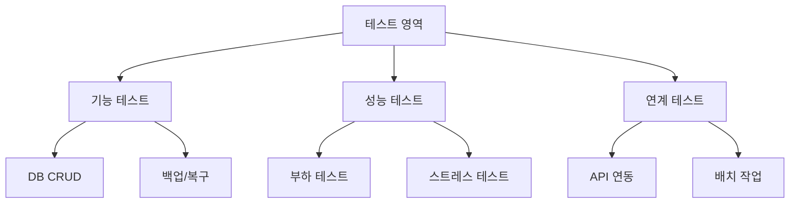

# 테스트 계획서 [Test Plan]

## 1. 테스트 개요
### 1.1. 테스트 범위

### 1.2. 테스트 시나리오
| 구분 | 테스트 항목 | 예상 결과 | 판정 기준 |
|------|------------|-----------|-----------|
| 기능 | DB 연결 | 정상 연결 | 응답 < 1초 |
| 성능 | 동시 접속 | 처리 가능 | TPS > 1000 |
| 연계 | API 호출 | 정상 응답 | 오류율 < 0.1% |